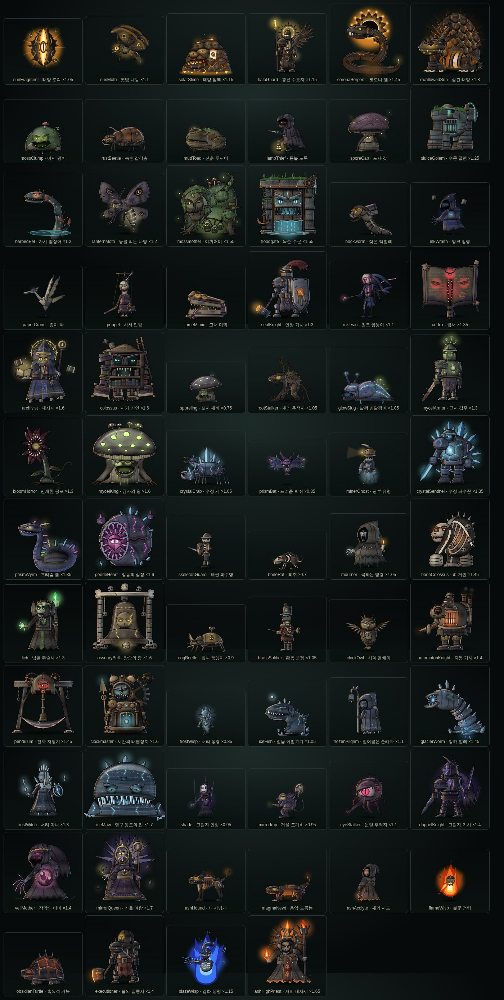

# 루멘 디센트 (Lumen Descent)

등불 하나를 들고, 태양이 떨어진 대우물 속으로 열 개 층을 내려가는 브라우저 덱 빌딩 로그라이크입니다.
「슬레이 더 스파이어」의 장르 규칙에 바치는 오마주이며, 이야기·인물·카드·그림은 모두 새로 만들었습니다.



## 특징
- **영웅 3명**: 세라(등불 기사), 노아(조수 연금술사), 린(그림자 암살자). 각자 고유 카드 풀과 시작 유품이 있습니다.
- **10개 층, 몬스터 70종**: 층마다 배경, 일반·정예 몬스터, 보스가 있습니다.
- **2세대 아트**: 외부 이미지 없이 모두 코드로 그린 SVG입니다.
  - 부위별 관절 리그로 움직입니다.
  - 원통 음영, 림라이트, 금속 하이라이트로 입체감을 냅니다.
  - 몬스터마다 공격·방어·강화·피격·사망 동작과 고유 이펙트가 있습니다.
- **카드 103장 고유 일러스트**: 카드 이름에 맞는 장면을 모두 코드로 그립니다. 카드 틀도 캐릭터마다 재질과 모양이 다릅니다.
- **카드별 전투 이펙트**: Canvas로 그립니다.
- **밸런스 연구소**: 관리자 전용입니다. 봇 대량 시뮬레이션과 관전 기능이 있습니다.

## 실행
```bash
python3 build.py          # → lumen-descent.html, dist/index.html (단일 파일, 외부 JS 의존성 없음)
```
만든 `dist/index.html`(또는 `lumen-descent.html`)을 브라우저로 열면 됩니다.

## 배포
- **Cloudflare Pages**: GitHub 저장소를 연결해 두면 `main` 에 push할 때마다 자동 배포됩니다.
  빌드 명령 `python3 build.py`, 출력 폴더 `dist`. 대시보드 설정 순서는 [docs/DEPLOY.md](docs/DEPLOY.md) 를 보세요.
- **claude.ai 아티팩트**: 확인용으로 계속 씁니다. https://claude.ai/artifact/F8D7dxYLdyp63ZqmS4kRdh

## 구조
| 경로 | 내용 |
|---|---|
| `src/engine.js` | 게임 규칙: 카드, 적, 층, 지도, 전투, 봇. `window.LD` |
| `src/ui.js` | 화면과 입력, 전투 연출. 리그 동작과 이펙트를 연결합니다 |
| `src/lab.js` | 밸런스 연구소(관리자) |
| `src/cardart.js` | 카드 일러스트: 카드마다 고유 장면(103장) |
| `src/scale.js` | 화면 배율: 1920×1080보다 큰 모니터에서 화면 전체를 같은 비율로 키웁니다 |
| `src/fx.js` | 배경 장면과 카드·몬스터 이펙트 (Canvas) |
| `src/art.js`, `src/art2.js` | 1세대 SVG 그림. 아이콘·카드 그림·대체용 |
| `src/rig.js` | 2세대 리그 엔진: 그리기 키트, 뼈대 런타임, 유형별 동작 생성기 |
| `src/rigbake.js` | 리그 굽기: 정지 조각을 비트맵으로 구워 렌더링 비용을 줄입니다 |
| `src/heroes.js` | 영웅 3명의 리그 |
| `src/mon/f1~f10_*.js` | 층별 몬스터 리그 (70종) |
| `src/monfx.js` | 몬스터별 공격·방어 이펙트 표 |
| `src/rigart.js` | 전투 밖 초상화에 새 그림을 연결합니다 |
| `tools/riglab.py` | 리그 검수 도구 (정지 자세 모음, 동작 프레임) |
| `tools/e2e.py` | 통합 테스트 (새 게임을 자동으로 진행) |
| `tools/webcheck.py` | 웹 배포 점검 (dist/ 를 HTTP로 띄워 아티팩트 객체·저장소 차단·외부 요청 확인) |
| `docs/DEPLOY.md` | Cloudflare Pages 배포 안내 |
| `tools/MONSTER_GUIDE.md` | 몬스터 리그 작성 가이드 (화풍·API·검증 절차) |
| `preview/` | 세라 2세대 아트 시안 페이지 |

## 검증
Playwright와 Chromium이 필요합니다.
```bash
python3 build.py
python3 tools/riglab.py check                        # 모든 몬스터 리그 생성·동작 오류 검사
python3 tools/riglab.py sheet out.png mossClump      # 정지 자세 모음
python3 tools/riglab.py frames out.png mossClump     # 공격/방어/피격/시전/사망 프레임
python3 tools/riglab.py cards out.png sera --art      # 카드 그림 모음(빌드 후)
python3 tools/e2e.py sera 1280 800 run1 6            # 방 6개 자동 진행
python3 tools/webcheck.py                            # 일반 웹 환경 점검(모바일 390×844)
```
